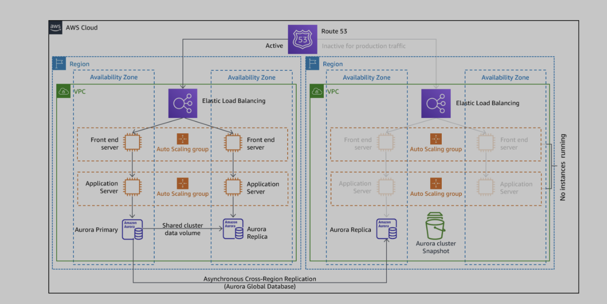

# AWS Regional Disaster Recovery with Terraform - **Recovery Zone**

This project aims to provide a PoC environment to implement several strategies on AWS disaster recovery. This repository creates the recovery service for the primary service described in [aws-dr-terraform](https://gitlab.com/xebia-security/aws-dr-terraform).

## Cloud Diagram

The project will generate a subset of the following diagram (*source: [AWS Disaster Recovery Workloads](https://docs.aws.amazon.com/whitepapers/latest/disaster-recovery-workloads-on-aws/disaster-recovery-options-in-the-cloud.html#warm-standby)*). This repository implements **the region in the right**, which corresponds to the replication service. The diagram shows a typical configuration for the **Pilot Light** strategy. **Warm stand-by** would show one EC2 instance active at all times, and **Multi-site active** will show a mirrored version of the left region. 

## Configuration

**Region**: `eu-west-1`. Can be changed at [providers.tf](https://gitlab.com/xebia-security/aws-disaster-recovery-with-terraform-replication-zone/-/blob/main/providers.tf)

**Modes**: Pilot Light, Warm Stand-by, Multi-region Deployment.

### Pilot light

On [variables.tf](https://gitlab.com/xebia-security/aws-disaster-recovery-with-terraform-replication-zone/-/blob/main/variables.tf), change the desired capacity of the autoscaler group to `0`. When entering recovery mode, you can scale this capacity to `1` or `2` (or any other value you may need, providing the maximum capacity is also changed). You can revert these changes later and EC2 instances created due to this change will be decommissioned when scaling down. 

### Warm stand-by

On [variables.tf](https://gitlab.com/xebia-security/aws-disaster-recovery-with-terraform-replication-zone/-/blob/main/variables.tf), change the desired capacity of the autoscaler group to `1`. When entering recovery mode, you can scale this capacity to `2` (or any other value you may need, providing the maximum capacity is also changed). You can revert these changes later and EC2 instances created due to this change will be decommissioned when scaling down.  

### Multi-site active

On [variables.tf](https://gitlab.com/xebia-security/aws-disaster-recovery-with-terraform-replication-zone/-/blob/main/variables.tf), change the desired and minimum capacity of the autoscaler group to `2`. This option will provide you with an exactly replicated and functional environment as the original one. 

## How to deploy

This project has been built on Terraform 1.3.6. While other versions may still work, it has not been tested. Update to 1.3.6 or give it a run and see if it works as-is :)
- Clone this repository and `cd` into it.
- Use `terraform init` to initialize your workspace. 
- Make sure you [add your AWS credentials for the project](https://blog.knoldus.com/add-aws-credentials-in-terraform/).
- Use `terraform plan` to check the changes and `terraform apply` to execute the deployment. 
- You can now log in into the AWS Management Console and check all resources have been deployed correctly. 
- Go to EC2 -> Load Balancers and check the DNS name for the created load balancer. 
- In your browser, access the DNS name over HTTP. 
- You will see a website informing you about the hostname of the service. If you refresh the page several times, you can see it changes since it is a load balancer calling two possible instances. 
